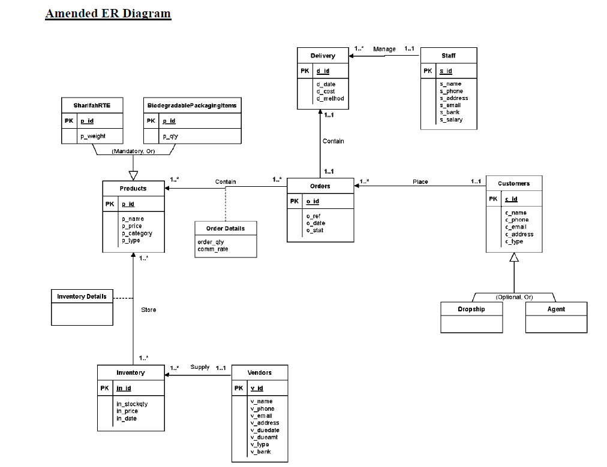

# Inventory & Order Database System

A relational database project designed to manage customers, orders, products, inventory, vendors, deliveries, and staff.

This project was originally developed as part of a Database System Fundamentals assignment and later organized into a portfolio-ready Oracle SQL project.

## Features

- Customer management
- Product management
- Order processing
- Inventory tracking
- Vendor management
- Delivery management
- Staff records
- Order-product relationships
- Inventory-product relationships

## Database Design

The database contains the following main tables:

- Customers
- Products
- Orders
- Order_Details
- Inventory
- Inventory_Details
- Vendors
- Staff
- Delivery

## ER Diagram



## Database Relationships

Examples of relationships implemented in the database include:

- A customer can place multiple orders.
- An order can contain multiple products through `Order_Details`.
- Products can appear in inventory through `Inventory_Details`.
- A vendor supplies inventory records.
- A delivery is associated with an order and a staff member.

## Normalization

The database schema was designed and checked up to **Third Normal Form (3NF)**.

The schema uses:

- Primary keys for unique record identification
- Foreign keys to maintain referential integrity
- Composite primary keys for junction tables
- Separation of entities to reduce redundancy

Examples of composite keys:

- `Order_Details (o_id, p_id)`
- `Inventory_Details (in_id, p_id)`

## SQL Files

### `create_tables.sql`

Contains the Oracle SQL statements used to create all database tables, including:

- Primary keys
- Foreign keys
- Composite keys
- Oracle data types

### `sample_data.sql`

Contains sample `INSERT` statements used to populate the database with demonstration records.

### `queries.sql`

Contains SQL query examples demonstrating:

- SELECT
- WHERE
- ORDER BY
- INNER JOIN
- LEFT JOIN
- GROUP BY
- HAVING
- COUNT
- SUM
- AVG
- MAX
- MIN
- Subqueries
- Multiple-table joins
- Calculated columns

## Example Query

```sql
SELECT
    o.o_id,
    c.c_name,
    p.p_name,
    od.order_qty,
    p.p_price,
    (od.order_qty * p.p_price) AS total_amount
FROM Orders o
INNER JOIN Customers c
    ON o.c_id = c.c_id
INNER JOIN Order_Details od
    ON o.o_id = od.o_id
INNER JOIN Products p
    ON od.p_id = p.p_id
ORDER BY o.o_id;
```

## Technologies

- Oracle SQL
- Relational Database Design
- ER Modelling
- Database Normalization
- Primary & Foreign Keys
- SQL Joins and Aggregation

## How to Run

Run the SQL files in this order:

1. `create_tables.sql`
2. `sample_data.sql`
3. `queries.sql`

Recommended environment:

- Oracle Database
- Oracle SQL Developer

## Documentation

The original university assignment report is available in the `documentation` folder.

## What I Learned

Through this project, I gained experience in:

- Designing relational database schemas
- Creating logical ER diagrams
- Identifying primary and foreign keys
- Applying normalization up to 3NF
- Creating tables using Oracle SQL
- Writing SQL joins and subqueries
- Working with aggregate functions
- Querying data across multiple related tables
